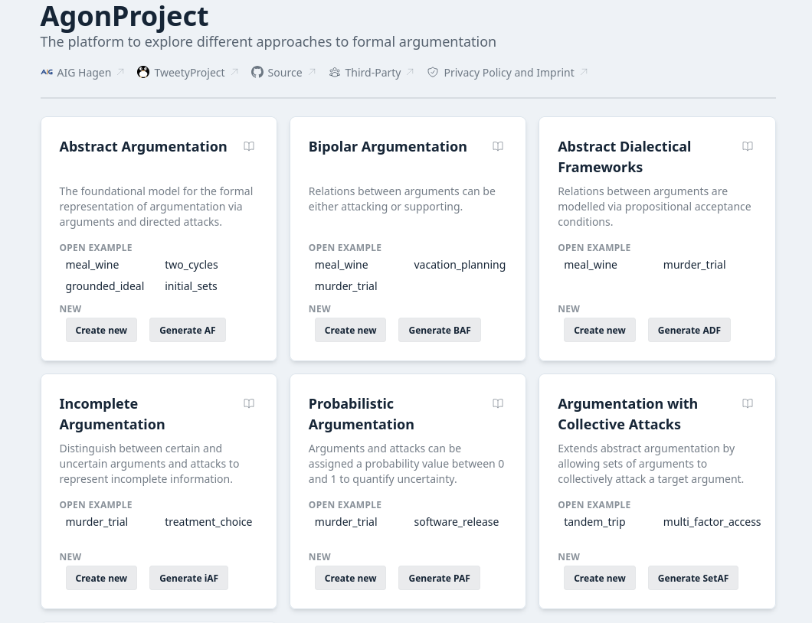

# AgonProject

The platform to explore different approaches to formal argumentation.

[](https://agonproject.aig.fernuni-hagen.de/)
[](./LICENSE)



## Supported Frameworks

- **Abstract Argumentation (AF)** — the foundational model, with arguments and directed attacks
- **Bipolar Argumentation (BAF)** — extends AF with support relations between arguments
- **Dialectical Argumentation (ADF)** — argument acceptance governed by propositional acceptance conditions
- **Incomplete Argumentation (iAF)** — distinguishes certain and uncertain arguments and attacks
- **Probabilistic Argumentation (PAF)** — assigns probability values to arguments and attacks
- **Argumentation with Collective Attacks (SetAF)** — extends AF with attacks originating from sets of arguments

## Features

- **Interactive graph editor** — create and connect arguments visually, with undo/redo and auto-layouting
- **Semantical evaluation** — compute extensions/interpretations under a wide range of semantics, with results highlighted directly on the graph
- **Argument-ranking semantics** — compute argument-ranking semantics for abstract argumentation
- **Serialisation sequences** — step through how admissible sets are built up incrementally via Serialisability
- **Step-by-step tutorials** — guided, per-framework tutorials for both editing and evaluation
- **Glossary with inline tooltips** — hover key terms for formal definitions, linked to their publications
- **Export** — LaTeX (TikZ), ICCMA, and TGF formats, alongside native save files
- **Sharing** — generate a link to share a framework instance with others

## Usage

### Public Deployment

Try it out at https://agonproject.aig.fernuni-hagen.de/

### OCI Image

[Container images](https://github.com/aig-hagen/AgonProject/pkgs/container/AgonProject) are provided and can be run with Docker, Podman or other container runtimes.

```sh
docker run -p 8080:8080 ghcr.io/aig-hagen/AgonProject:latest
```

## Acknowledgments

### [TweetyProject](https://tweetyproject.org/)

Semantic evaluation is powered by TweetyProject — a collection of Java libraries for argumentation and non-monotonic reasoning, developed by Matthias Thimm and contributors.

It is used here under the [GNU General Public License v3.0](https://www.gnu.org/licenses/gpl-3.0.html).

### [Graph Component](https://github.com/aig-hagen/aig_graph_component)

This component is used to display and edit graphs.

It is developed by the Artificial Intelligence Group of the University of Hagen and [licensed under the MIT License](third-party/aig-hagen/aig_graph_component/LICENSE.md).

## Development

Checkout the [development documentation](/docs/index.md) for working on this project.

## License

This project is licensed under the GNU General Public License v3.0.
See the [LICENSE file](./LICENSE) for details.
