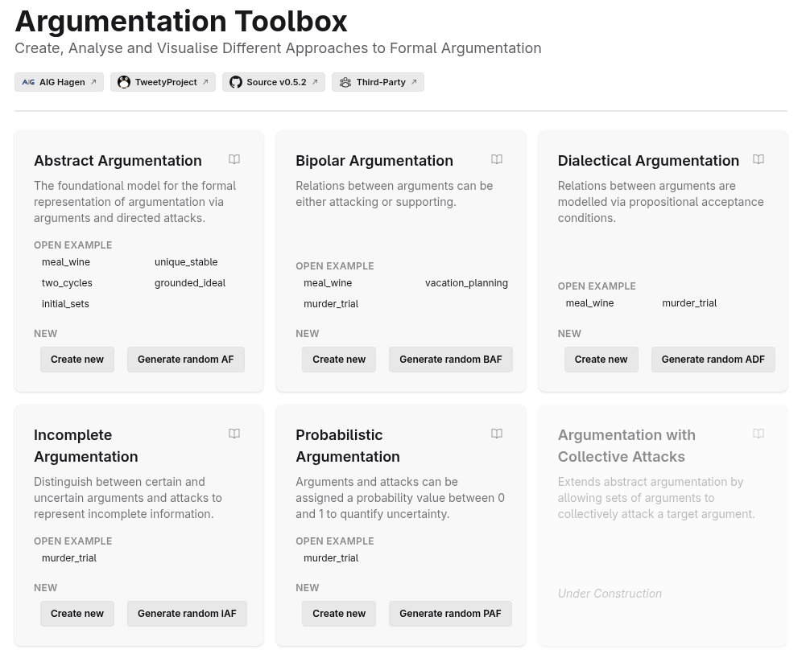

# Argumentation Toolbox

A graphical application to create, analyse and visualise different approaches to formal argumentation.

[](https://argumentation-toolbox.aig.fernuni-hagen.de/)
[](./LICENSE)



## Supported Frameworks

- **Abstract Argumentation (AF)** — the foundational model, with arguments and directed attacks
- **Bipolar Argumentation (BAF)** — extends AF with support relations between arguments
- **Dialectical Argumentation (ADF)** — argument acceptance governed by propositional acceptance conditions
- **Incomplete Argumentation (IAF)** — distinguishes certain and uncertain arguments and attacks
- **Probabilistic Argumentation (PAF)** — assigns probability values to arguments and attacks

## Usage

### Public Deployment

Try it out at https://argumentation-toolbox.aig.fernuni-hagen.de/

### OCI Image

[Container images](https://github.com/aig-hagen/argumentation-toolbox/pkgs/container/argumentation-toolbox) are provided and can be run with Docker, Podman or other container runtimes.

```sh
docker run -p 8080:8080 ghcr.io/aig-hagen/argumentation-toolbox:latest
```

## Acknowledgments

### [TweetyProject](https://tweetyproject.org/)

Semantic evaluation is powered by the TweetyProject — a collection of Java libraries for argumentation and non-monotonic reasoning, developed by Matthias Thimm and contributors.

It is used here under the [GNU General Public License v3.0](https://www.gnu.org/licenses/gpl-3.0.html).

### [Graph Component](https://github.com/aig-hagen/aig_graph_component)

This component is used to display and edit graphs.

It is developed by the Artificial Intelligence Group of the University of Hagen and [licensed under the MIT License](third-party/aig-hagen/aig_graph_component/LICENSE.md).

## Development

Checkout the [development documentation](/docs/index.md) for working on this project.

## License

This project is licensed under the GNU General Public License v3.0.
See the [LICENSE file](./LICENSE) for details.
