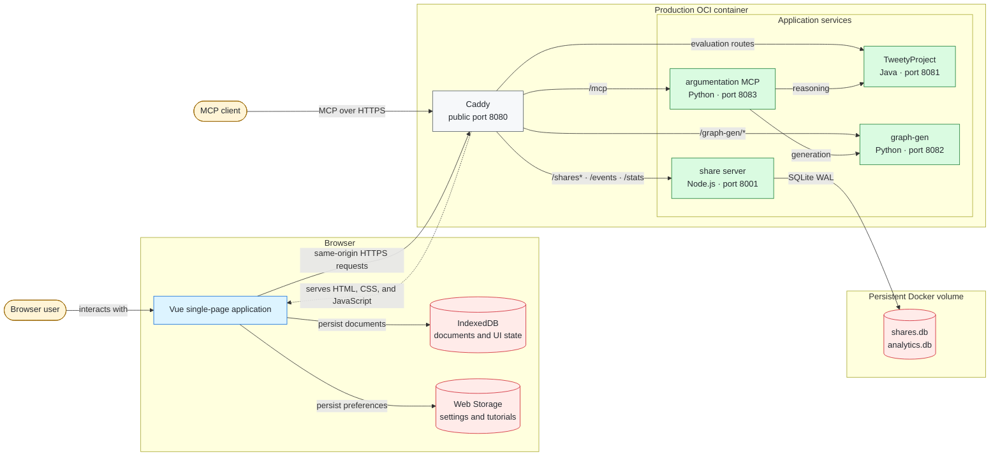
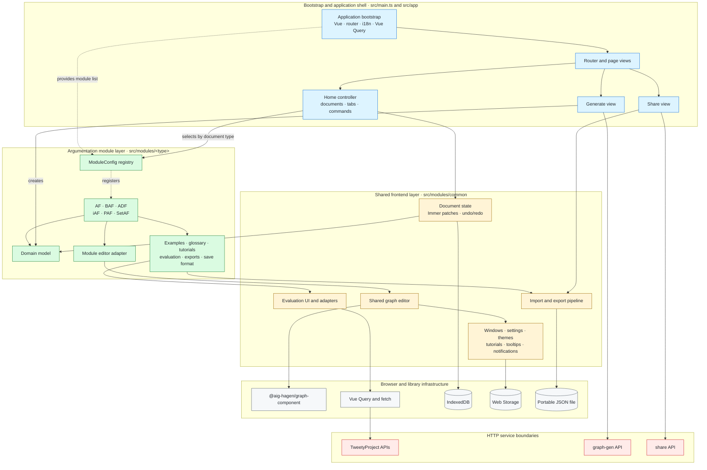

# Architecture Overview

This document describes the system boundaries and the way data moves through AgonProject. For a
file-by-file map, see [repository structure](./structure.md). For instructions on changing the
system, see [CONTRIBUTING.md](/CONTRIBUTING.md).

## System context

AgonProject is a Vue single-page application backed by several small services. Editing, layout,
local persistence, tutorials, glossary rendering, and export happen in the browser. Computationally
expensive semantics, random generation, sharing, and aggregated analytics use HTTP services.

In development Vite serves the frontend and proxies browser API paths to ports 8080, 8000, and 8001. The MCP server is independent of the browser stack. In production one image runs every
process and Caddy provides the single public origin, static-file serving, routing, headers, and
rate limits.

Solid arrows are runtime calls or data writes. The dashed arrow is the application bootstrap: Caddy
delivers the frontend bundle, which then executes in the browser. Only the red storage nodes retain
data across page loads or container replacement.

## Frontend boundaries

[`src/app/`](/src/app/) owns the application shell: routing, the home and tab experience, random
generation, shared-link loading, privacy, and third-party notices.

[`src/modules/`](/src/modules/) owns argumentation behavior. Each formalism supplies a model,
editor adapter, examples, glossary, tutorials, evaluation integration, exports, and portable save
format. A [`ModuleConfig`](/src/app/home/moduleConfig.ts) is the integration boundary between a
module and the application shell. The registered module list in [`src/main.ts`](/src/main.ts)
determines what the application exposes.

[`src/modules/common/`](/src/modules/common/) contains infrastructure shared across formalisms:
graph editing, evaluation UI and HTTP transport, document state, import/export, windows, settings,
themes, notifications, tutorials, and tooltips. Framework-specific knowledge should remain in its
module unless more than one module genuinely uses it.

The dashed relationships are registration/configuration performed during startup. Solid arrows are
runtime dependencies or data flow. The module-specific editor translates its domain model into the
shared graph-editor state; the common editor does not need to know which formalism it is displaying.

## State and persistence

There are three distinct persistence contracts:

| Data                                                | Storage                                 | Contract                                                                  |
| --------------------------------------------------- | --------------------------------------- | ------------------------------------------------------------------------- |
| Open documents, edit history, per-document UI state | Browser IndexedDB, database `documents` | Internal and versioned with the application                               |
| Settings, theme, locale, tutorial progress          | Browser local storage                   | Internal keys owned by composables                                        |
| Saved files, examples, and share content            | Portable JSON                           | Public contract documented in [save-format.md](../formats/save-format.md) |

Document edits produce Immer patches. The document state retains forward and inverse patches for
undo/redo, while `useDocuments` serializes module models into IndexedDB. This internal serialization
must not be treated as an interchange format. Portable files pass through Zod schemas and are the
compatibility boundary for users and share links.

## Service responsibilities

| Service           | Public paths                                                                         | Responsibility                                                               | Persistent state |
| ----------------- | ------------------------------------------------------------------------------------ | ---------------------------------------------------------------------------- | ---------------- |
| TweetyProject     | `/dung`, `/setaf`, `/bipolar`, `/rankings`, `/adf`, `/serialisation`, `/paf`, `/iaf` | Semantics and reasoning                                                      | None owned here  |
| graph-gen         | `/graph-gen/*`                                                                       | Random framework generation                                                  | None             |
| share             | `/shares*`, `/events`, `/stats`                                                      | Share storage and anonymous aggregated analytics                             | SQLite           |
| argumentation MCP | `/mcp`                                                                               | Typed tools for AF reasoning and generation                                  | None             |
| Caddy             | all public paths                                                                     | Static SPA, reverse proxy, headers, caching, maintenance mode, rate limiting | None             |

The service READMEs own exact request and response contracts, except TweetyProject, whose
contract is documented in the [reasoning backend API reference](./reasoning-backend-api.md) since
its code is vendored third-party. The production routes and security controls are defined in
[`deployment/Caddyfile`](/deployment/Caddyfile).

## Important data flows

### Evaluation

An evaluation window constructs a module-specific request. Vue Query invokes the shared fetch
layer, Vite or Caddy routes it to TweetyProject, and the module adapter validates and maps the result
back to application argument IDs. Results are view state; they are not uploaded to the share server.

### Random generation

The Generate view loads available algorithms and framework types from graph-gen, submits parameters,
and converts the returned structure into a module model. A generated framework becomes persistent
only when opened as a browser document or explicitly saved/shared.

### Sharing

The frontend serializes a document using its portable save format and sends that string to the
share service. The server returns an opaque short ID. Opening `/share/:id` retrieves the string and
uses `apiVersion` to select the module loader. The server does not interpret framework content.

### MCP

An MCP client calls the public `/mcp` endpoint or runs the server over stdio. The MCP adapter
validates a canonical AF representation and delegates reasoning to TweetyProject or generation to
graph-gen. It is stateless and is not a dependency of the browser application.

## Deployment characteristics

The production image deliberately contains several processes. The wrapper starts them and exits
when one exits; the container restart policy then restarts the unit. Only Caddy's port is published.
The Docker volume mounted at `/opt/share-server/data` is the only server-side durable application
state. See [deployment and operations](../operations/deployment.md) for configuration and lifecycle
procedures.
